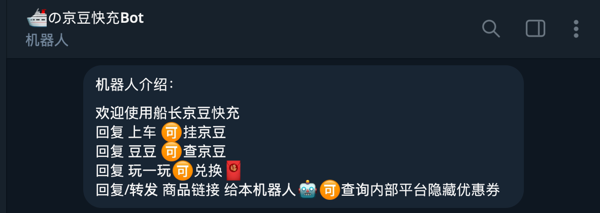

【船新脚本使用教程】(脚本发布频道:https://t.me/HarbourToulu)

``` bash
# 拉库命令：
ql repo https://github.com/HarbourJ/HarbourToulu.git "jd_" "activity|backUp|jd_sign" "^jd[^_]|USER|utils|ql|JD|sendNotify" "main"
```

🛳不支持部分2.14.x版本青龙（内置python版本为3.11.x），不兼容，建议退回2.13.x及以下版本或更新到最新的2.15.x版本（内置python版本为3.9.x-3.10.x）

``` bash
# 青龙面板安装命令：
docker run -dit \
  -v $PWD/ql:/ql/data \
  -p 5700:5700 \
  --name ql-debian \
  --hostname ql-debian \
  --restart unless-stopped \
  whyour/qinglong:debian-python3.10
```

本项目所有算法都编译在jd_sign.so文件内，所以**拉库后请先安装jd_sign.so依赖文件**
- 方式一：运行一键安装脚本（jd_check_sign.py），实现一键式全自动安装sign本地依赖文件
- 方式二：若自动安装报错，可去【 `https://github.com/HarbourJ/HarbourToulu/releases` 】下载架构与Py版本适配的文件解压放置 **/scripts/HarbourJ_HarbourToulu_main**文件夹内。

📢特别说明：运行监控脚本需要安装redis以缓存Token缓解高峰期403问题
``` bash
docker-redis安装教程: 

①.先安装redis
复制以下命令到ssh一键安装

mkdir -p /mydata/redis/conf
touch /mydata/redis/conf/redis.conf
docker run -p 6379:6379 --name redis \
-v /mydata/redis/data:/data \
-v /mydata/redis/conf/redis.conf:/etc/redis/redis.conf \
-itd redis redis-server /etc/redis/redis.conf \
--appendonly yes

②.再青龙安装Python的redis依赖 （依赖管理 python3-->新建依赖-->redis）
配置文件设置redis环境变量(可不填，使用默认127.0.0.1:6379)：

export redis_url=""  # 填redis服务器ip
export redis_port=""   # 支持更换自定义端口
export redis_pwd=""  # 未设置redis密码就空着


运行库里redisTest测试脚本（jd_redisTest.py）测试redis是否正常连接。
``` 

【🛳船长库脚本汇总及变量🛳】

* [x] jinggeng邀请入会有礼 (jd_jinggengInvite.py)
变量: export jinggengInviteJoin="活动🆔&shopid"


* [x] 微定制组队通用脚本（jd_wdz.py）
变量: export jd_wdz_activityId="活动🆔"


* [x] 邀好友赢大礼（jd_inviteFriendsGift.py）
变量: export jd_inv_authorCode="活动🆔"


* [x] 一键领取店铺会员礼包（jd_shopCollectGift.py）
变量: export jd_shopCollectGiftId="活动🆔"


* [x] 特效关注有礼 (jd_wxShopGift.py)
变量: export jd_wxShopGiftId="活动🆔"


* [x] 生日礼包（jd_wxBirthGifts.py）
变量: export jd_wxBirthGiftsId="活动🆔"


* [x] 完善信息有礼（jd_wxCompleteInfo.py）
变量: export jd_wxCompleteInfoId="活动🆔&venderId"


* [x] 加购有礼（jd_wxCollectionActivity.py）
变量: export jd_wxCollectionActivityUrl="活动🔗" 
默认跑前10个账号，可自定义运行加购账号数量，变量：export jd_wxCollectionActivityRunNums="需要运行账号数量"


* [x] jd_shopFollowGift.py(关注有礼-JK)
脚本变量: export jd_shopFollowGiftId="shopId1&shopId2&..." #变量为店铺🆔; export jd_shopFollowGiftRunNums="需要运行账号数量"


* [x] jd_wxShopFollow.py(关注店铺有礼-JK)
脚本变量: export jd_wxShopFollowId="活动🆔" #变量为店铺🆔; export jd_wxShopFollowRunNums="需要运行账号数量,默认前12个账号"


* [x] jd_dpcj.py(店铺抽奖-JK)
脚本变量: export DPCJID="shopId1&shopId2&..." #变量为店铺🆔


* [x] 通用开卡-shopLeague系列脚本（jd_shopLeague_opencard.py）
变量: export jd_shopLeagueId="活动🆔"
并发变量: export jd_shopLeagueId_uuid=“你的助力码”


* [x] 通用开卡-joinCommon系列脚本（jd_joinCommon_opencard.py）
脚本变量: export jd_joinCommonId="活动🆔&shopid"
并发变量: export jd_joinCommon_uuid=“你的助力码”


* [x] jd_lzkjInteract邀请有礼(jd_lzkjInteract.py)
脚本变量: export jd_lzkjInteractUrl="活动链接🔗"
并发变量: export jd_lzkjInteractUserId=“你的助力码”

# 京豆快充bot
支持APP扫二维码登录、短信登录和账密登录:
https://t.me/HarbourTestBot

